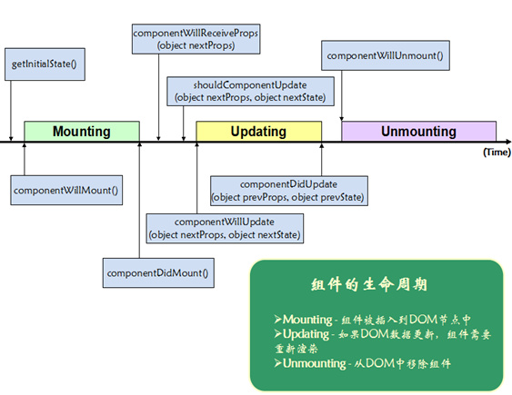

#组件生命周期都有哪些

## base

* 1 Render

```
当调用的时候，会检测 this.props 和 this.state，返回一个单子级组件。该子级组件可以是虚拟的本地 DOM 组件（比如 <div /> 或者 React.DOM.div()），也可以是自定义的复合组件。

你也可以返回 null 或者 false 来表明不需要渲染任何东西。实际上，React 渲染一个 <noscript> 标签来处理当前的差异检查逻辑。当返回 null 或者 false 的时候，this.getDOMNode() 将返回 null。

render() 函数应该是纯粹的，也就是说该函数不修改组件 state，每次调用都返回相同的结果，不读写 DOM 信息，也不和浏览器交互（例如通过使用 setTimeout）。如果需要和浏览器交互，在 componentDidMount() 中或者其它生命周期方法中做这件事。保持 render() 纯粹，可以使服务器端渲染更加切实可行，也使组件更容易被理解。
```
* 2 getInitialState 在组件挂载之前调用一次。返回值将会作为 this.state 的初始值。
* 3 getDefaultProps

```
在组件类创建的时候调用一次，然后返回值被缓存下来。如果父组件没有指定 props 中的某个键，则此处返回的对象中的相应属性将会合并到 this.props （使用 in 检测属性）。

该方法在任何实例创建之前调用，因此不能依赖于 this.props。另外，getDefaultProps() 返回的任何复杂对象将会在实例间共享，而不是每个实例拥有一份拷贝。
```
* 4 propTypes
* 5 mixins
* 6 statics
* 7 displayName
## 声明周期方法
* 8 挂载： componentWillMount

```
服务器端和客户端都只调用一次，在初始化渲染执行之前立刻调用。如果在这个方法内调用 setState，render() 将会感知到更新后的 state，将会执行仅一次，尽管 state 改变了。
```
* 9 挂载： componentDidMount

```
在初始化渲染执行之后立刻调用一次，仅客户端有效（服务器端不会调用）。在生命周期中的这个时间点，组件拥有一个 DOM 展现，你可以通过 this.getDOMNode() 来获取相应 DOM 节点。

如果想和其它 JavaScript 框架集成，使用 setTimeout 或者 setInterval 来设置定时器，或者发送 AJAX 请求，可以在该方法中执行这些操作。
```
* 10 更新： componentWillReceiveProps
* 11 更新： shouldComponentUpdate
* 12 更新： componentWillUpdate

```
在接收到新的 props 或者 state 之前立刻调用。在初始化渲染的时候该方法不会被调用。

使用该方法做一些更新之前的准备工作。
```
* 13 更新： componentDidUpdate

```
在组件的更新已经同步到 DOM 中之后立刻被调用。该方法不会在初始化渲染的时候调用。

使用该方法可以在组件更新之后操作 DOM 元素。
```
* 14 移除： componentWillUnmount

```
在组件从 DOM 中移除的时候立刻被调用。

在该方法中执行任何必要的清理，比如无效的定时器，或者清除在 componentDidMount 中创建的 DOM 元素。
```
>

2016年3月20日